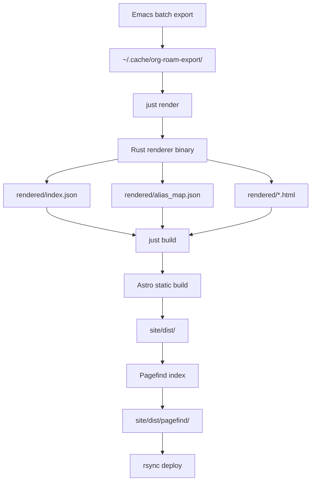

# addisonbeck.com - CLAUDE.md

## Overview

addisonbeck.com is a static site that renders an org-roam second brain as a public-facing web reader. A Rust binary converts org-element AST JSON exports into HTML fragments; Astro consumes those fragments to build a fully static site with backlink navigation and full-text search via Pagefind.

The org-roam export cache is committed to `export-cache/` in this repository. The Nix devshell automatically syncs `~/.cache/org-roam-export/` → `export-cache/` on entry, so by the time any `just` command runs, the local data is current. CI uses `export-cache/` directly from the checkout.

## Architecture & Patterns

### System Diagram



### Build Pipeline

1. `nix develop` — enters the Nix devshell; automatically syncs `~/.cache/org-roam-export/` → `export-cache/`
2. `just render` — runs `cargo run --release` in `renderer/`, reads `export-cache/` and writes `rendered/`
3. `just build` — runs `just render` then `npm run build` in `site/`, which produces `site/dist/` and runs Pagefind indexing

`just build` reads from `export-cache/`. If `export-cache/manifest.json` is missing, the renderer will fail. Always enter `nix develop` before running `just` commands to ensure the cache is current.

### Directory Structure

```
website-redesign/
├── renderer/           # Rust crate: org-element AST → HTML fragments
├── site/               # Astro project: static site generation
├── export-cache/       # Committed org-roam export data (synced from ~/.cache/org-roam-export/ by devshell)
├── rendered/           # Build artifact (gitignored): renderer output
├── .github/
│   └── workflows/
│       └── deploy.yml  # CI/CD: Nix build + rsync deploy
├── rust-toolchain.toml # Pins Rust 1.94.1 stable
├── justfile            # Build orchestration commands
└── flake.nix           # Nix devshell definition
```

## Stack Best Practices

### Toolchain

- **Rust**: 1.94.1 stable, pinned via `rust-toolchain.toml`. Always use `nix develop` to enter the shell — do not rely on system Rust.
- **Astro**: Static output mode with `@astrojs/svelte` for islands and `astro-pagefind` for search indexing.
- **Package manager**: npm only. Do not use pnpm or yarn.
- **Nix devshell**: All development must happen inside `nix develop`. The shell provides Rust, Node.js, just, and rsync.

### Available Commands

All `just` commands must be run from inside `nix develop`. The devshell provides the correct Rust, Node.js, and tooling versions — `just` is not meaningful outside it.

```bash
just render        # Run Rust renderer: reads cache, writes rendered/
just build         # Full build: render + Astro build + Pagefind index
just dev           # Watch mode: re-renders on cache changes, serves Astro dev server
just update-deps   # Refresh lock files to latest compatible versions (no major bumps)
just upgrade-deps  # Upgrade all deps to absolute latest, including major version bumps
```

### GitHub Actions Secrets

The deploy workflow requires exactly these four secrets — do not rename them:

| Secret | Purpose |
|--------|---------|
| `DEPLOY_HOST` | SSH hostname of the server |
| `DEPLOY_USERNAME` | SSH login username |
| `DEPLOY_KEY_PRI` | Private SSH key (PEM format) |
| `DEPLOY_PATH` | Destination path on the server |

## Anti-Patterns

- **Never commit `rendered/`** — this is a build artifact regenerated from `export-cache/`.
- **Do not manually edit `export-cache/`** — it is managed by the devshell sync from `~/.cache/org-roam-export/`. Edit your org-roam nodes in Emacs, re-export, then re-enter `nix develop`.
- **Never commit `site/dist/`** — this is the Astro build output.
- **Do not change GitHub Actions secret names** — the workflow references `DEPLOY_HOST`, `DEPLOY_USERNAME`, `DEPLOY_KEY_PRI`, and `DEPLOY_PATH` exactly.
- **Do not use pnpm** — this project uses npm. Using pnpm will create a `pnpm-lock.yaml` and break the Nix build.
- **Do not run builds outside `nix develop`** — the Rust toolchain version is pinned and must come from the Nix shell.
- **Do not call `nix develop --command` from within a just recipe** — just recipes already execute inside the devshell when invoked correctly. Wrapping them in `nix develop --command` spawns a nested shell unnecessarily. The only valid use of `nix develop --command just ...` is from outside the devshell, e.g. in CI.

## Data Models

### org-roam Export Format

Each org-roam node is exported as a JSON file at:
```
export-cache/<shard>/<UUID>.json
```
(synced from `~/.cache/org-roam-export/` by the Nix devshell on entry)

Where `<shard>` is the first two characters of the UUID (e.g., `ab/abcd1234-...json`).

A `manifest.json` at the cache root lists all exported nodes:
```json
[
  { "id": "UUID", "file": "shard/UUID.json" }
]
```

Node JSON fields: `id`, `title`, `tags`, `aliases`, `links_to`, `linked_from`, `ast` (org-element AST as JSON), `point`, `level`.

Only nodes tagged `public` are included in the export.

### Renderer Output

The renderer writes to `rendered/`:
- `rendered/index.json` — array of `IndexEntry` objects (id, title, slug, aliases, tags, backlinks, last_modified)
- `rendered/alias_map.json` — map of alias slug → canonical slug
- `rendered/<UUID>.html` — pre-rendered HTML fragment for each node

## Configuration, Security, and Authentication

### Deployment

Deployment is triggered by pushing to `main`. GitHub Actions runs `nix develop --command just build` and rsyncs `site/dist/` to the configured Mail-in-a-Box server via SSH.

The SSH private key (`DEPLOY_KEY_PRI`) must be added to the server's `~/.ssh/authorized_keys` before deployment will succeed.

### Nix Devshell

```bash
nix develop       # Enter devshell
direnv allow      # If .envrc is configured, auto-enter on cd
```

The devshell uses `rust-overlay` to provide the exact Rust version from `rust-toolchain.toml`.
